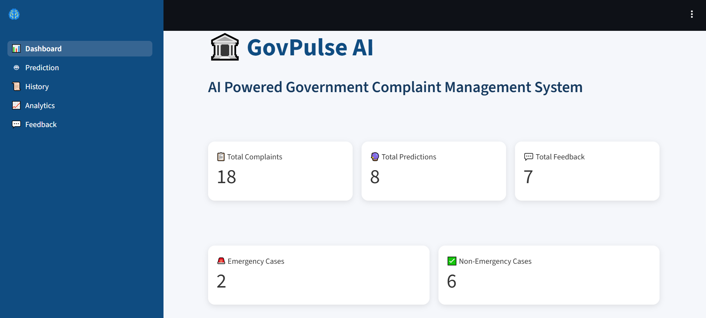
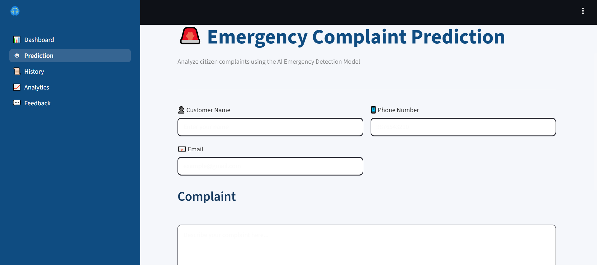
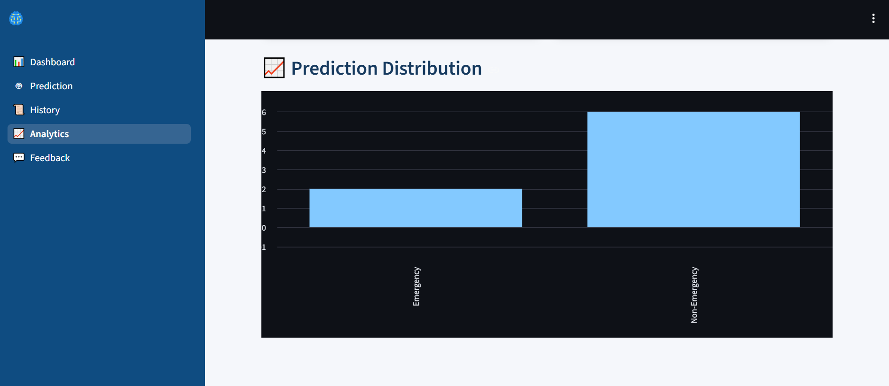
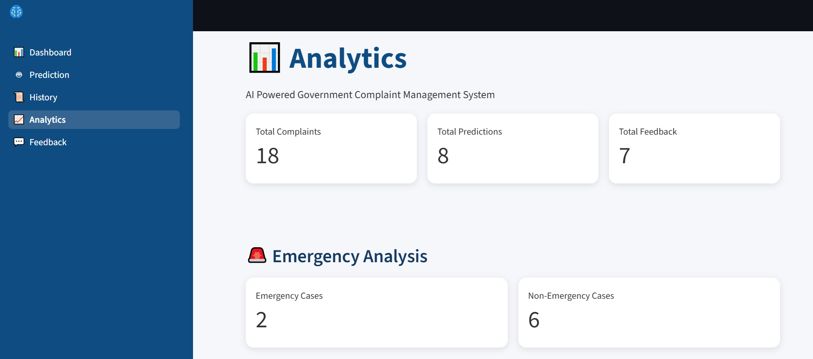
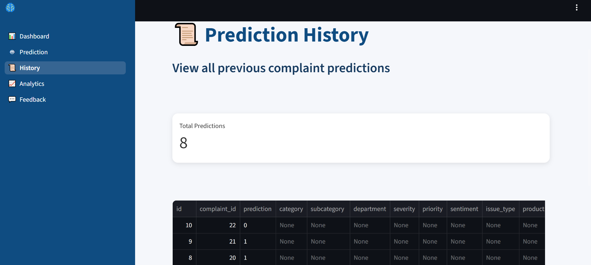
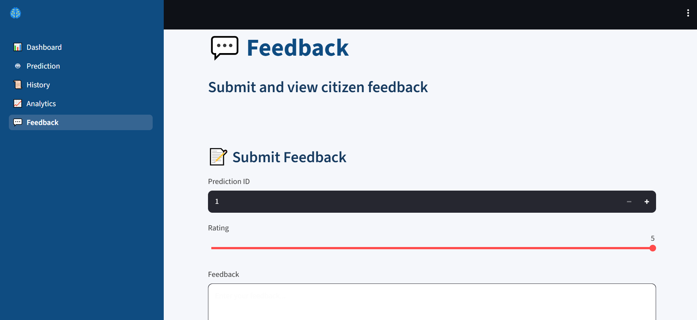

# GovPulse_AI
GovPulse AI is an AI-powered government complaint management system that analyzes citizen complaints
# 🚨 GovPulse AI – Government Complaint & Emergency Detection System

GovPulse AI is an AI-powered government complaint management and emergency detection system designed to analyze citizen complaints, detect emergency situations, classify complaints, and provide analytics through an interactive Streamlit dashboard.

The project combines Machine Learning, FastAPI, Streamlit, Supabase, and Render to provide a complete end-to-end AI application.

---

## 📌 Project Overview

GovPulse AI processes citizen complaints and social-media-style text data using Machine Learning models.

The system can:

- Detect emergency and non-emergency complaints
- Analyze citizen complaints
- Perform sentiment analysis
- Predict government departments
- Classify complaint-related information
- Store complaints and prediction history
- Collect user feedback
- Display analytics
- Provide an interactive Streamlit dashboard
- Expose Machine Learning functionality through FastAPI
- Deploy the backend and frontend using Render

---

# 🏗️ System Architecture

```text
                    ┌─────────────────────────┐
                    │      Citizen/User       │
                    └────────────┬────────────┘
                                 │
                                 ▼
                    ┌─────────────────────────┐
                    │   Streamlit Frontend    │
                    │      Dashboard          │
                    └────────────┬────────────┘
                                 │
                                 │ HTTP Requests
                                 ▼
                    ┌─────────────────────────┐
                    │      FastAPI Backend    │
                    │                         │
                    │  REST API Endpoints     │
                    │  ML Predictions         │
                    │  Analytics              │
                    └────────────┬────────────┘
                                 │
              ┌──────────────────┼──────────────────┐
              │                  │                  │
              ▼                  ▼                  ▼
      ┌──────────────┐   ┌──────────────┐   ┌──────────────┐
      │ ML Models    │   │   Supabase   │   │ Prediction   │
      │              │   │   Database   │   │   History    │
      └──────────────┘   └──────────────┘   └──────────────┘

# GovPulse AI

AI-Powered Government Complaint Management and Emergency Detection System.

## 🚀 Live Application

Frontend: https://govpulse-ai-2.onrender.com

Backend: https://govpulse-ai-backend.onrender.com

## 📸 Application Screenshots

### 🏠 Dashboard


### 🔮 Emergency Prediction


### 📊 Analytics


### 📈 Analytics Overview


### 🕒 Prediction History


### 💬 Feedback

